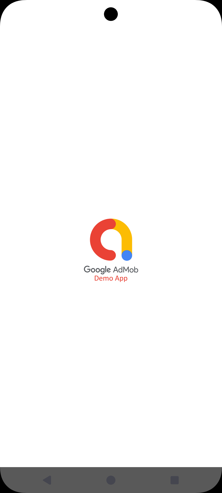
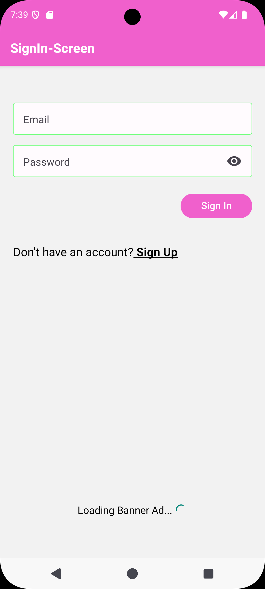
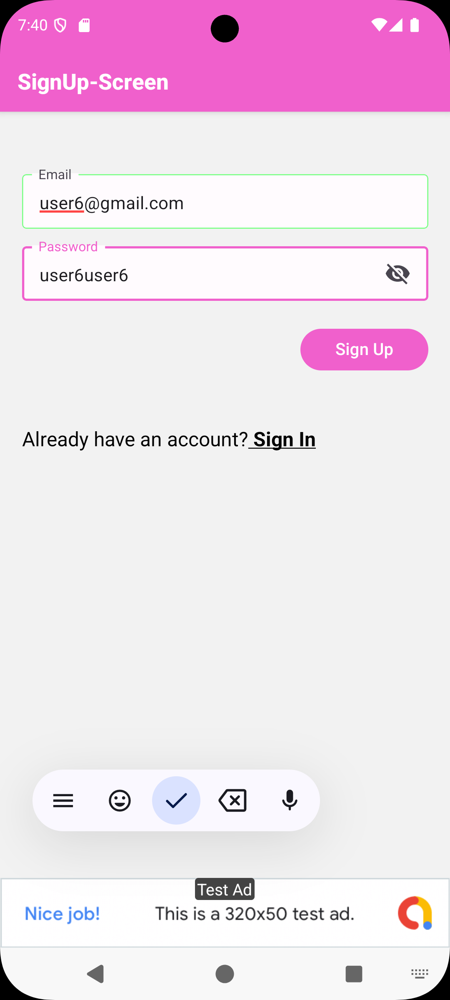
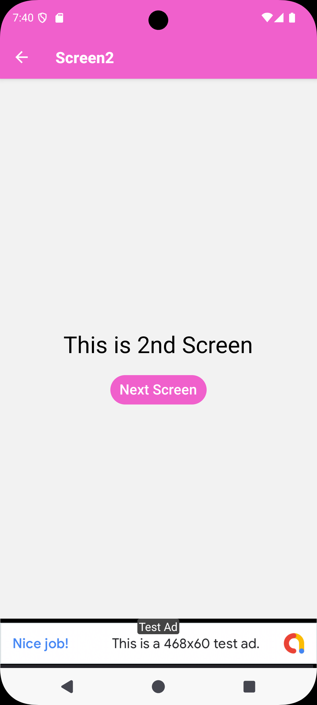
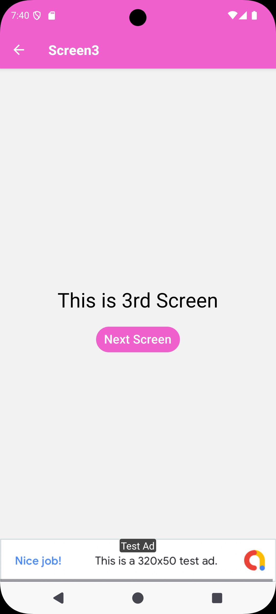
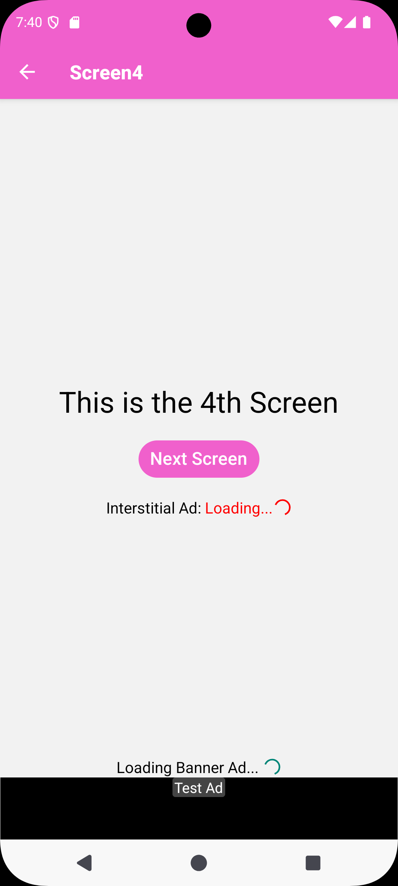
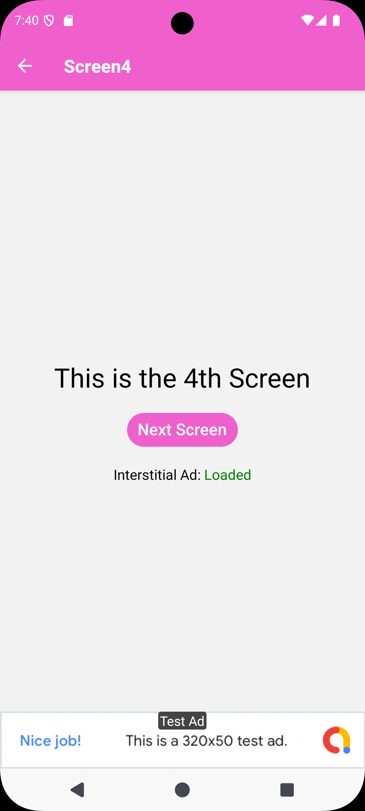
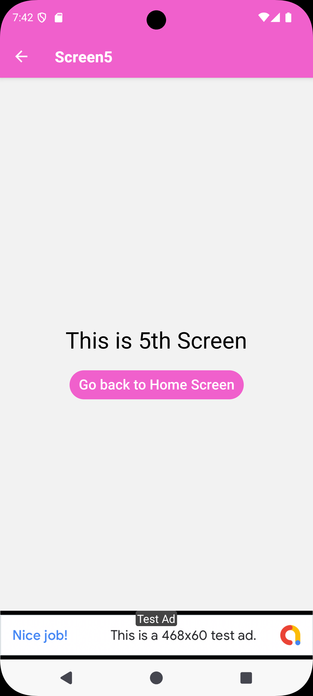
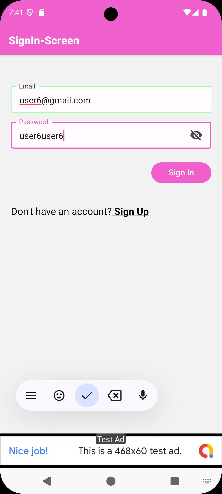
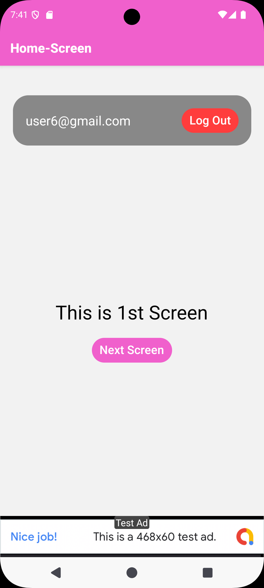

# Note: 
### Screenshots and demo-video of the project are included in the folder 'Screenshots_and_demo-video' of the repository.

# About This Project
This is a new [**React Native**](https://reactnative.dev) project, bootstrapped using [`@react-native-community/cli`](https://github.com/react-native-community/cli).

This project is a simple android application which shows the implementation of Ads through Google AdMob:

Following are the features of this application:
1) Create account (Login/SignUp) through 'Firebase Authentication'.
2) App-Open Ad is shown after splash screen.
3) Banner Ad is shown at the bottom of each screen (except the splash screen).
4) Interstitial Ad is shown after "4th Screen" and before the "5th Screen", but if interstittial ad is not loaded then the app transitions to "5th Screen" without showing the ad.

In this project: 
1) The authorization is implemented using 'Firebase Authentication'.
2) App-Open-ads, Banner-Ads, Interstitial-Ads are implemented through 'Google AdMob'.
3) Google TestAd-Ids are stored in the 'Ad-Ids.js' file present in the directory "src/Ad-Ids.js".

### Tech Stack
1) React Native
2) Google AdMob (for Ads implementation)
3) Firebase Authentication (for user authentication)

# How To Run This Project
## Step 1: Setup the enviromnet
Make sure you have completed the [Set Up Your Environment](https://reactnative.dev/docs/set-up-your-environment) guide before proceeding.

## Step 2: Setup Firebase
Setup 'firebase' files in the project, according to your google account. Such as including the 'goolge-services.json' file in the directory: "android/app/goolge-services.json".

## Step 3: Replace the Ad-Ids
In the directory: "src/Ad-Ids.js", replace the Google TestAd-Ids with your own Ad-Ids (to show Ads of your choice).

## Step 4: Add your App-Id
In the root directory, in the file: "app.json", replace the value of "android_app_id" with your own Google AdMob App-ID.

## Step 5: Build and run your app
Make sure that the 'Android Studio' Emulator is running.
Navigate to the root directory of the project in 'command prompt' and run the following commands:

```sh
npm i
```

wait for packages to finish getting installed. Then run the command:

```sh
npm run android
```
The app will get installed in the 'Android Studio' Emulator and start running.

# Screenshots:













